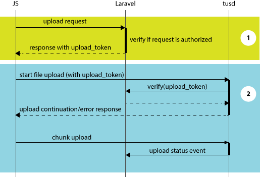

## How the upload flow works

The upload process is separated in two distinct phases:

1. Granting the upload to the client
2. Transfering the file via Tus protocol

### Granting the upload to the client

The first phase has the primary objective to authenticate the user that is making the upload request.

The client sends a post request to `/uploadjobs` with the details of the upload in json format, especially the request 
identifier and the filename. The `/uploadjobs` route is defined under the `web`, therefore a valid session is needed.
The authorization of the upload request is performed with the help of the `upload-via-tus` Gate. 
The Gate receives the request, by default, with

- `id`: the client assigned request identifier
- `filename`: the name of the file to upload
- `filesize`: the size of the file
- `filetype`: the file mime type (can be null)

other input arguments may be present, if sent by the JS client.

If the request is authorized and validated, an entry in the upload queue table will be added, with a 
specific `upload_token`. The `upload_token` is returned to the client in order to verify that future calls 
with the tus protocol have been authorized. The `upload_token` has 1 hour validity, if the upload is not 
started within that timeframe, the whole flow must be executed again.
At the same time the `TusUploadStarted` event is triggered, so your Laravel application can do processing 
on the added upload entry. The event is asynchronous.

### Transfering the file via Tus protocol

After the upload is authorized and the client received the `upload_token` the normal flow of the Tus 
protocol is followed.

The client can start sending the preliminary information on the file to be uploaded, together 
with the `upload_token`. Once received by the tus server, the `pre-create` hook is invoked to let 
Laravel verify if the `upload_token` is valid. In case the token is still valid the upload is granted 
and the client can start sending file chunks.

While the file is being uploaded the tus server notify, in an asynchrounous way via the `post-receive` 
hook, the upload progress.
This is reflected in the upload jobs queue and also notified with the `TusUploadProgress` event.

Once the upload complete, the `TusUploadCompleted` event is triggered.

The application, within that event handler, can do operations on the file. It is encouraged to move the 
physical file to a different location than the tus server upload directory, as some file systems 
might have a limit on the number of files you can store in a directory.

In case the client aborts the transfer, the tus server will call the `post-terminate` hook. This will 
mark the upload as cancelled and contextually trigger the `TusUploadCancelled` event. 
The partial uploaded file might not exists anymore at the time of the `TusUploadCancelled` event, 
because the tus server might have already deleted it.
